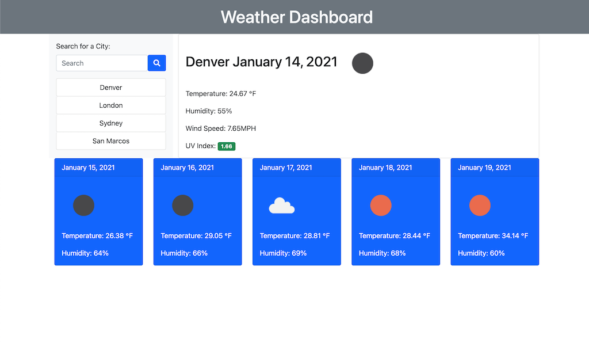

# Weather-Dashboard

## Description

The purpose of this application is to display current and future weather conditions for multiple cities for a user looking to travel. The application will use the OpenWeather API to retrive data and will dynamically update the HTML and CSS accordingly.

## Screen Shot

## Task List

- [x] When user searches for a city they are presented with current and future conditions for that city.
- [x] The searched city is added to search history.
- [x] User is presented with these conditions:
    - City Name
    - The Date
    - A Weather Icon
    - The Temperature
    - The Humidity
    - The Color Coded UV Index
- [x] User is presented with a 5 day forecast which includes these conditions for each day:
    - The Date
    - A Weather Icon
    - The Temperature
    - The Humidity
- [x] When the user clicks on the search history they are presented with all the above features for that city.
- [x] When the user opens the application they are presented with the last searched forecast.

## Deployed Link

https://trevorsmithbanjo.github.io/Weather-Dashboard/
     